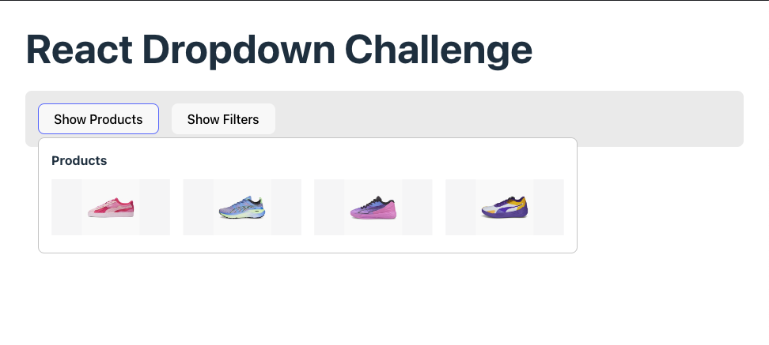
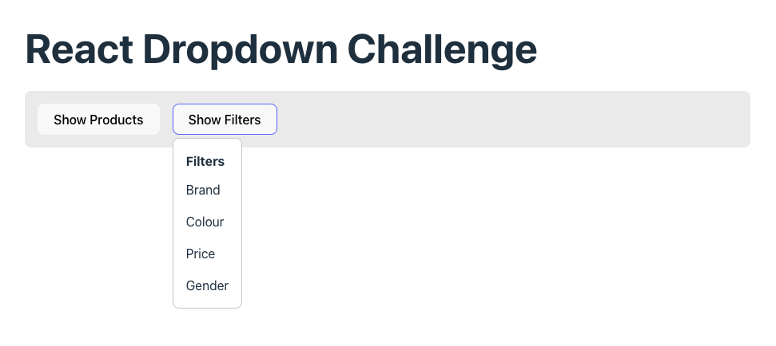

# React Dropdown Challenge

One particularly common UI pattern is to have a button, or some other element, that on an interaction will then reveal more, related content underneath.
Sometimes the content will be revealed on click of a button and then hidden when that button is clicked again.
Another variation would be the content being reveled on hover of the button and then hidden when the user hovers outside of both the button and the content.

## Requirements

We're going to make an App that has 2 examples of the behaviour described above.
1. The first example is a button with text "Show products" which shows the content (`<Products />`) when the button is hovered. The content should then be hidden if the user hovers outside either the button or the content.
2. The second example is a button with text "Show filters" that shows and hides the content (`<Filters />`) when it is clicked.

---

### Tips

- Write your code in `App.jsx`.
- We have provided you with the `Filters`, `Products` and `Button` components. You shouldn't need to modify these.
- You can write any styles you think you might need in `index.css`.

## Examples

### Products

### Filters

